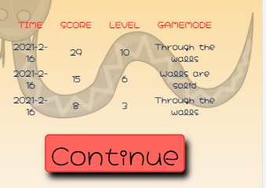

# Testing

[return to README.md](https://github.com/Dutchie1990/TheGameOfSnake)

# Table of Content 
- [User Story Testing](#User-Story-Testing)
- [Feature Testing](#Feature-Testing)
    - [Game mode feature](#Game-mode-feature)
    - [Game feature](#Game-feature)
    - [Control feature](#Control-feature)
    - [Game over feature](#Game-over-feature)
    - [Welcome screen feature](#Welcome-screen-feature)
    - [Levels feature](#Levels-feature)
    - [Scoreboard feature](#Scoreboard-feature)
    - [Animate screen transition](#Animate-screen-transition)
    - [Leader board feature](#Leader-board-feature)
    - [Swipe control feature](#Swipe-control-feature)
- [Validators](#Validators)
    - [HTML Validator](HTML-Validator)
    - [CSS Validator](#CSS-Validator)
    - [Javascript Validator](#Javascript-Validator)
- [Further Manual Testing](#Further-Manual-Testing)
    - [Lighthouse](#Lighthouse)
    - [amiresponsive](#amiresponsive)

# User Story Testing 

- As a site owner, I want my site to perform well so that my users do not have to wait on the game to load.

Please find more information on the performance of the website at the LightHouse section of this file. 

- As a site owner, I want my site to size depended on the device which is played on so my users can play on all devices.

Media queries and JavaScript are used to resize elements of the game depended on users device width and height. The game is playable on mobile devices as well as on tablets and large screen devices.

- As a site owner, I want to give my user the feeling of competition so that my user is triggered to come back and improve their gameplay.

To provide the user an highscore overview, the user is triggered to come improve their gameplay. The 3 highest scores will be shown when a user is gameover. These sores are stored in the local storage on the machine of the user. So when playing the game again on the same device the scores will be rendered again. 

- As a user, I want to select the game mode, that I can make the game more challenging.

To make the game challenging and attractive, 2 gameplays are introduced. In the "Through the Wall" gameplay, the player will appear on the other side of the canvas when hitting the wall. In the "Walls are Solid" gameplay the player will be defeated when hitting the walls. 

- As a user, I want to play the game on all devices, that I can always improve my gameplay whatever the device I use.

To ensure the gameplay at mobile devices and tablets, a control feature has been implemented. Those controls are visible on tablets and mobile devices. On desktops and laptops the arrow keys are used to navigate. 

- As a returning user, I want to see my performance in comparison with the best performance, that I know my standings in the competition.

As a returning user, my performance is stored in the local storage. So my own performances can be compared with current performance. Nevertheless, the performances of other users are not part of the product yet. This is a nice to have feature which is left to be implemented. For more detailed information, please navigate to the features section. 

# Feature Testing

### Game mode feature

The game should be played at two game modes which can be selected before starting the game. The following points are tested:

- selection game mode - OK 

- game play with different game modes - NOK

    BUG 1: when playing walls are solid game mode, on the right and upper side of the screen the gameover comes 15 pixel to soon.

- showing gamemode in the highscore table - OK

- reset of gamemode when returning to start screen - OK

### Game feature

- when ate food, the score should increase by 1 - OK

- when hitting own body, game should be game-over - OK

- when food is eaten, new food will be spawned - NOK

    BUG 2: in some cases the food is spawned at the snakes body

### Control feature

- at desktop arrow keys must be used as navigation - OK
- at desktop control elements are not visible - OK

- at tablets arrows and touchpad are visible - OK

- at mobile arrows and touchpad are visible - OK

- pressing right snake direction should be change to right, when snake moves vertical - OK 
- pressing left snake direction should be change to left, when snake moves vertical - OK
- pressing up snake direction should be change to up, when snake moves horizontal - OK
- pressing down snake direction should be change to down, when snake moves horizontal - OK
- pressing same direction, nothing should change - OK 
- pressing opposite direction, nothing shoul change - OK 

- pressing other keys - NOK

    BUG 3: when you hit a key different then arrows at the first key, reference exception is thrown

### Game over feature

- the continue button is clickable to return to start game screen - OK

- highscores are rendered into table - OK
- the score and level is presented to the user - OK

### Welcome screen feature

- welcome animation is fired when starting the website - OK
- welcome animation is done, and buttons are clickable - OK 

### Levels feature

- after each 3 food eaten, the snake should increase level 
- when increase level speed should be increased

### Scoreboard feature

- 3 highest scores will be shown in the scoreboard - OK

- scores will be saved to local storage when leaving the page - OK

- sores will be loaded into highScores variable when starting the game - OK 

### Animate screen transition

- screen transition will start when hit the continue button - OK
- screen transition will end and all buttons are clickable again - OK 

### Leader board feature

This feature is left to be implemented. For this feature to track scores of different users on different devices, databases are needed. Using this technology is not part of this assignment of Code Institute. 

### Swipe control feature

- the swipe control can be selected 
- swiping right snake direction should be change to right, when snake moves vertical
- swiping left snake direction should be change to left, when snake moves vertical
- swiping up snake direction should be change to up, when snake moves horizontal
- swiping down snake direction should be change to down, when snake moves horizontal
- swipe same direction, nothing should change
- swipe opposite direction, nothing shoul change

# Validators
### [HTML Validator]
### [CSS Validator]
### [Javascript Validator]
# Further Manual Testing
### [Lighthouse]
### [amiresponsive]
